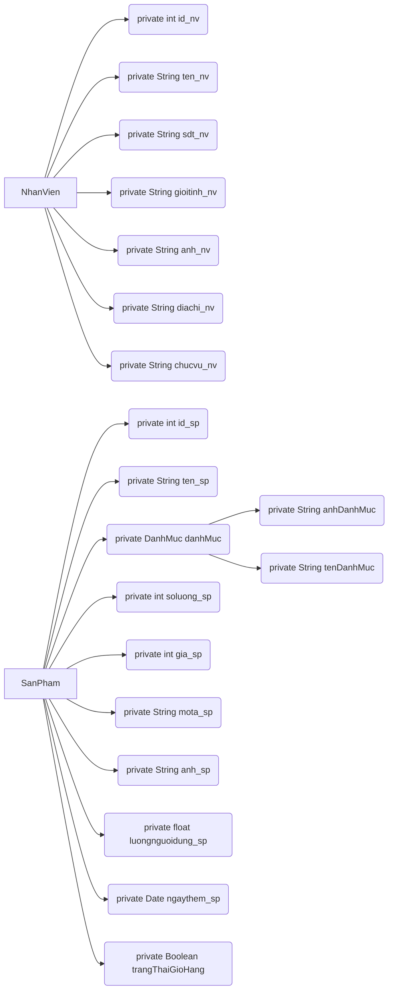

# Welcome to Ứng Dụng Quản Lí Hàng Hoá!

Ứng dụng thuộc chương trình đồ án Android cơ bản năm 2019 trường cao đẳngHueic,
mọi chi tiết vui lòng fdai3105@gmail.com

# IDE and Simulator

Viết bởi Android Studio và hoạt động ổn định trên giả lập Pixel 2 XL API 22 - Adroid 5.x

# Cấu trúc

# Finish
https://ff3105.github.io/
vui lòng tôn trọng bản quyền
